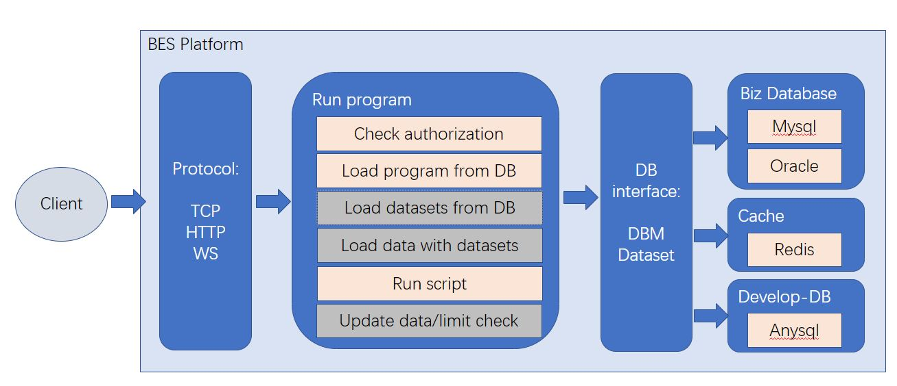
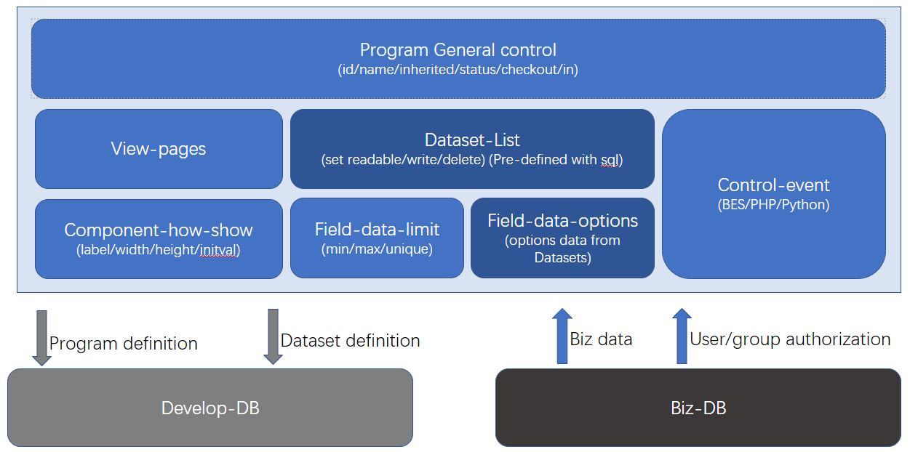

# Business Executing Sysytem Platform​

## Overviews
A comprehensive platform made in china​

As development tool for frontend and backend program​

Define a program quickly, supports check-in and check-out​

Supports inheritable program, unified pre-defined dataset object​

Have a BES script language, embeds PHP language, Python language​

Save to DB, build and release package easily​

As server for alpha test , beta test and production environment​

Supports tcpip/http/websocket protocol​

Embed authorization management: user/role/group, field&data-query/update​

Unify DB API  and DBM buffer for easily and quickly accessing DB data​

Support multiple app servers and multiple containers and multiple DBs​

## BES Platform Hierarchy​

## BES Program structure

## BES Program inherit property​

## BES Script Language-part1

## BES Script Language-part2

