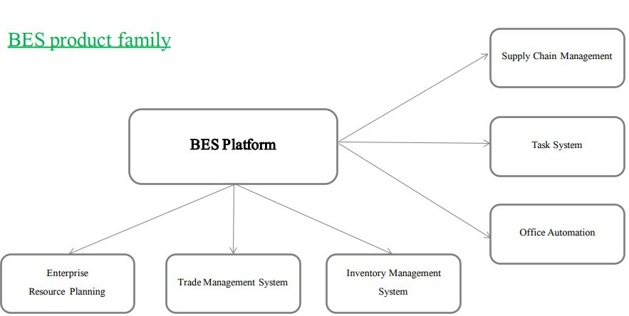
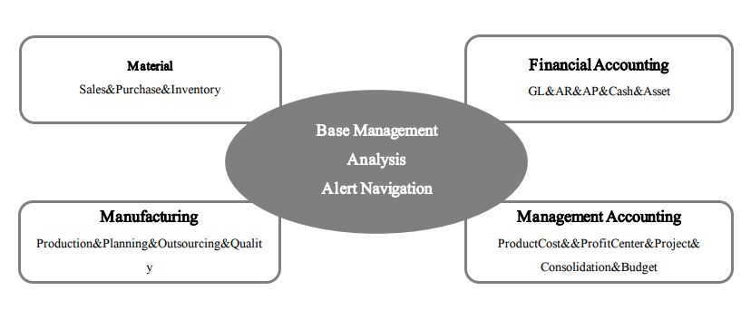
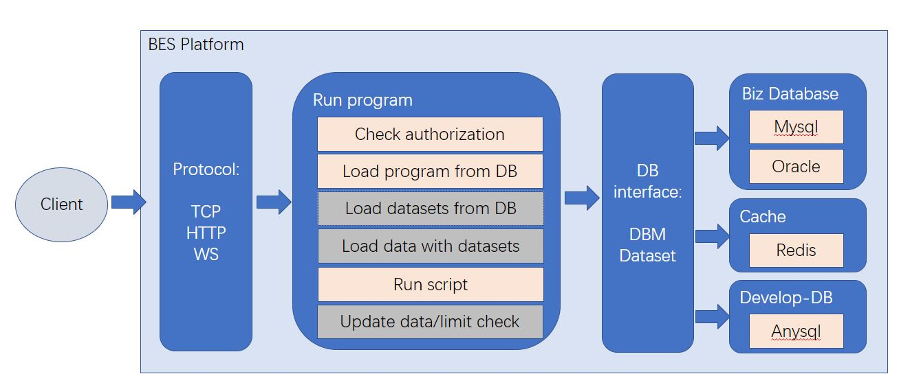
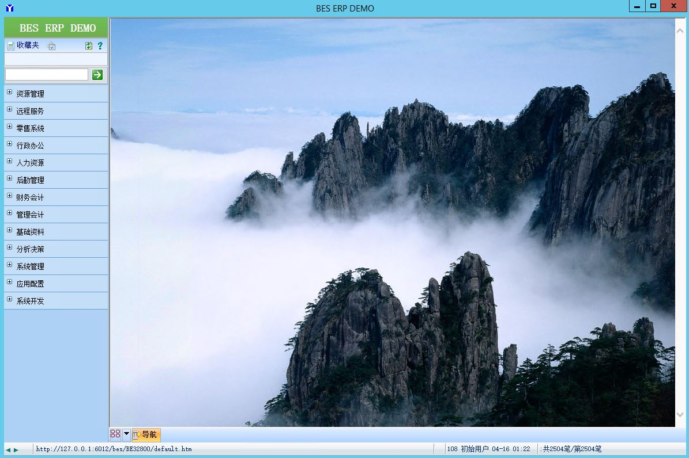

# Business Executing Sysytem

BES: Business Executing Sysytem

BES is a platform for enterprise management;
on which there are many management systems developed;
Enterprise can customize in the current system when using;

## BES product family

## BES ERP Modules(Enterprise Resource Planning)

[BES ERP introduction >](./BES-ERP-introduction.md)

## BES Platform Hierarchy​

[BES Platform introduction >](./BES-Platform-introduction.md)

## BES ERP DEMO (chinese version)
1. install BES-ERP client
- In Windows OS
- [download client package](./install/BES-ERP-DEMO/BES-Client.zip) 
- > unzip BES-Client.zip
2. run BES-ERP client 
- > .\BES-Client\iclient.exe
3. The home Page:

## BES Platform 
- Designer：QIAN RUAN
- Developer：QIAN RUAN
- Ownership of copyright: QIAN RUAN

