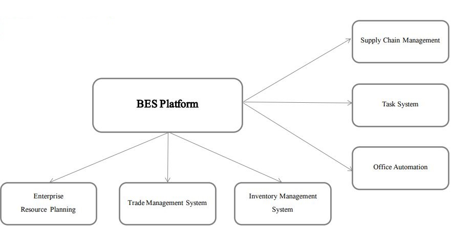

# Business Executing Sysytem

BES: Business Executing Sysytem

BES is a platform for enterprise management;
on which there are many management systems developed;
Enterprise can customize in the current system when using;

## BES product family

## BES ERP(Enterprise Resource Planning)

[BES ERP introduction >](./BES-ERP-introduction.md)

## BES Platform Hierarchy​

[BES Platform introduction >](./BES-Platform-introduction.md)

